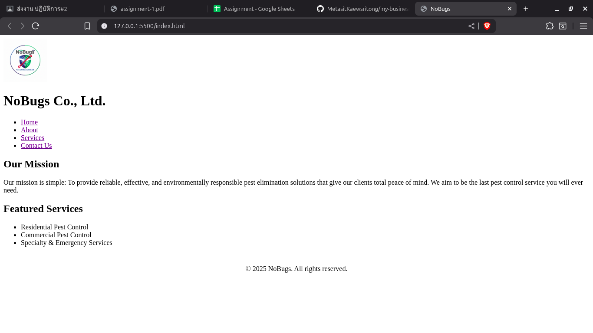
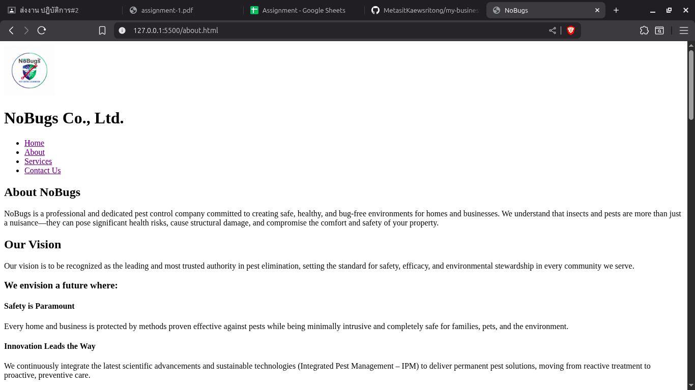
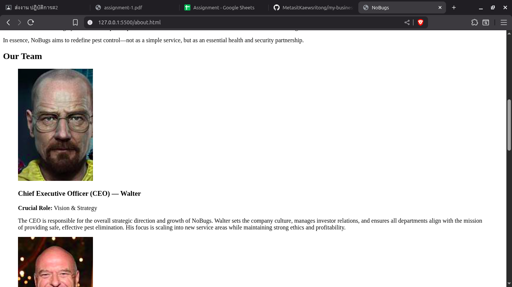
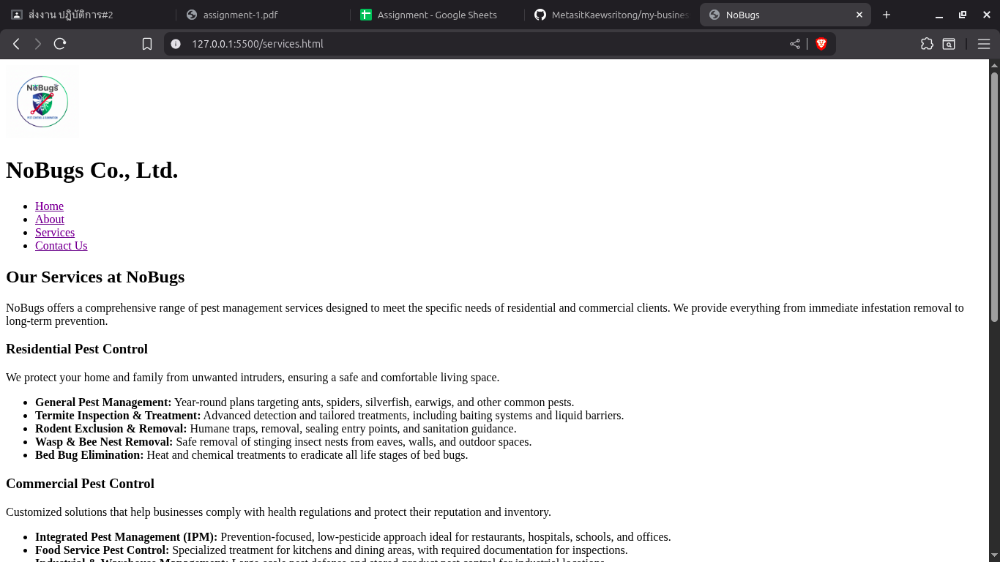
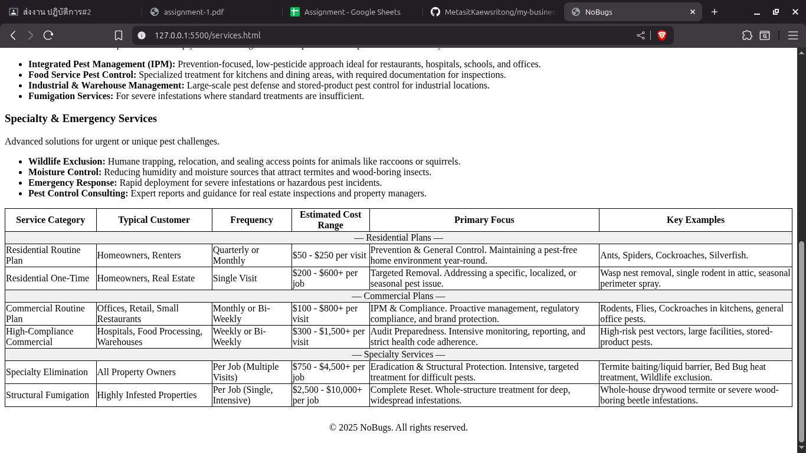
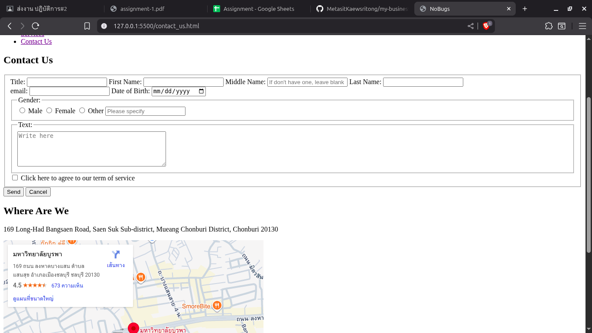

เว็บไซต์ธุรกิจ NoBugs

โปรเจกต์นี้คือเว็บไซต์อย่างเป็นทางการของ **NoBugs Co., Ltd.** ซึ่งเป็นธุรกิจกำจัดแมลงและควบคุมศัตรูพืช ที่มุ่งมั่นในการสร้างสภาพแวดล้อมที่ปลอดภัย ถูกสุขลักษณะ และปราศจากแมลงสำหรับบ้านเรือนและธุรกิจ โดยมีภารกิจหลักคือการมอบโซลูชันการกำจัดศัตรูพืชที่มีประสิทธิภาพ ปลอดภัย และมีความรับผิดชอบต่อสิ่งแวดล้อม

เว็บไซต์ถูกออกแบบมาเพื่อนำเสนอข้อมูลสำคัญของบริษัทอย่างครบถ้วน ประกอบด้วย:
**วิสัยทัศน์:** เป็นผู้นำและได้รับความไว้วางใจสูงสุดในด้านการกำจัดศัตรูพืช
**บริการ:** รายละเอียดของบริการควบคุมศัตรูพืชสำหรับที่อยู่อาศัย เชิงพาณิชย์ และบริการเฉพาะทาง
**โครงสร้างราคา:** ตารางเปรียบเทียบช่วงราคาโดยประมาณสำหรับบริการประเภทต่าง ๆ
**ทีมผู้บริหาร:** ข้อมูลบุคลากรหลักในตำแหน่งสำคัญ (CEO, COO, CTCO, CCRO, CFO) พร้อมรูปภาพประกอบ
**การติดต่อ:** แบบฟอร์มติดต่อและที่ตั้งบริษัท

โครงสร้างไฟล์ (File Structure)
my-business-web
├── index.html
├── about.html
├── services.html
├── contact_us.html
├── Pictures/
│ └── ...
└── README.md

